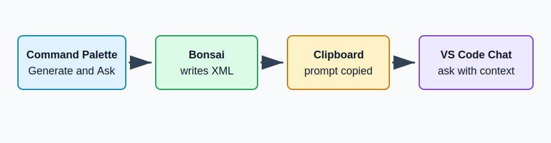

# ContextShrink

ContextShrink turns a repo into small, inspectable XML or JSON for LLMs. It walks files, shrinks code into useful shapes, counts tokens, and writes context you can paste into Codex, Claude, Copilot, ChatGPT, or another coding agent.

## Quick Start

Download a release binary. No Rust needed.

macOS Apple Silicon:

```sh
curl -L -o contextshrink https://github.com/MickyBalladelli/context-shrink/releases/latest/download/contextshrink-macos-arm64
chmod +x contextshrink
./contextshrink --version
```

Linux x64:

```sh
curl -L -o contextshrink https://github.com/MickyBalladelli/context-shrink/releases/latest/download/contextshrink-linux-x64
chmod +x contextshrink
./contextshrink --version
```

Run inside any repo:

```sh
./contextshrink .
```

This writes:

```text
contextshrink.xml
```

Need clipboard instead of a file?

```sh
./contextshrink . --prompt --output clipboard
```

Or install from source:

```sh
cargo install --path .
```

Install straight from GitHub:

```sh
cargo install --git https://github.com/MickyBalladelli/context-shrink.git
```

If installed on `PATH`, run:

```sh
contextshrink .
```

Copy it into your LLM and ask:

```text
Use this ContextShrink XML as repo context. Summarize the architecture and tell me where to start reading.
```

## What It Is Good For

Use ContextShrink when you want broad repo context that is visible and repeatable:

```text
Summarize this project.
Explain the architecture.
Find likely entry points.
Prepare context before asking another LLM.
Compare token savings before sending repo context.
```

It is less useful when the agent already has the exact file or function you want edited.

## Common Commands

Architecture map:

```sh
contextshrink . --level 3
```

Detailed repo context:

```sh
contextshrink . --max-tokens 12000 --level 2
```

Only scan `src`:

```sh
contextshrink src
```

Write somewhere else:

```sh
contextshrink . --output-file /tmp/contextshrink.xml
```

Write JSON:

```sh
contextshrink . --format json --output-file /tmp/contextshrink.json
```

Write a paste-ready prompt:

```sh
contextshrink . --prompt --output-file /tmp/contextshrink-prompt.txt
```

Show selected files:

```sh
contextshrink . --print-files
```

Measure token savings:

```sh
contextshrink . --max-tokens 12000 --stats
```

Filter files:

```sh
contextshrink . --include 'src/**' --exclude '**/generated.rs'
```

## Install

Release binaries:

```text
contextshrink-macos-arm64
contextshrink-linux-x64
```

Download from:

```text
https://github.com/MickyBalladelli/context-shrink/releases/latest
```

From this repo:

```sh
cargo install --path .
```

From git:

```sh
cargo install --git https://github.com/MickyBalladelli/context-shrink.git
```

Or build a local binary:

```sh
cargo build --release
target/release/contextshrink .
```

Tagged releases publish:

```text
contextshrink-linux-x64
contextshrink-macos-arm64
contextshrink-linux-x64.sha256
contextshrink-macos-arm64.sha256
contextshrink-vscode-*.vsix
```

The Codex plugin, Claude Code plugin, and VS Code extension find the binary in this order:

```text
CONTEXTSHRINK_BIN
contextshrink on PATH
repo-local target/release/contextshrink
```

## Use With Agents

### Plain Paste

Generate context:

```sh
contextshrink . --max-tokens 12000 --level 2 --prompt --output-file /tmp/contextshrink-prompt.txt
```

Paste `/tmp/contextshrink-prompt.txt` into an LLM. It starts with:

```text
Use this ContextShrink XML as compressed repo context before answering.
```

### Codex

This repo includes a Codex plugin:

```text
plugins/contextshrink
```

Add the local marketplace:

```sh
codex plugin marketplace add "$HOME/dev/context-shrink/.agents/plugins"
```

Then install or enable `contextshrink` in Codex.

Ask:

```text
Use $contextshrink to compress this repo before answering.
```

The helper command is:

```sh
plugins/contextshrink/skills/contextshrink/scripts/run_contextshrink.sh . 12000 2 /tmp/contextshrink.xml
```

### Claude Code

This repo includes a Claude Code plugin:

```text
claude/contextshrink
```

Run Claude Code with the plugin:

```sh
claude --plugin-dir ./claude/contextshrink
```

Use the skill:

```text
/contextshrink:contextshrink
```

The helper command is:

```sh
claude/contextshrink/bin/contextshrink-claude . 12000 2 /tmp/contextshrink.xml
```

For local marketplace testing:

```sh
claude plugin marketplace add .
```

Then inside Claude Code:

```text
/plugin install contextshrink@context-shrink
```

### VS Code

The VS Code extension lives here:

```text
copilot/contextshrink-vscode
```

Install the packaged VSIX:

```sh
code --install-extension copilot/contextshrink-vscode/contextshrink-vscode-0.1.0.vsix
```

Run Command Palette:

```text
ContextShrink: Generate and Ask
```

If chat does not open automatically, paste the copied prompt into Copilot Chat, ChatGPT, or Codex in VS Code.

Other commands:

```text
ContextShrink: Generate Context
ContextShrink: Copy Context Prompt
ContextShrink: Copy Project Map
ContextShrink: Preview Project Map
ContextShrink: Open Last Context
```



## Levels

`--level 1` keeps full code first, then shrinks files if the token budget is too small.

`--level 2` keeps imports, signatures, types, classes, and function shapes. Function bodies become `...`.

`--level 3` keeps a compact tree map only.

## Before And After

Full source:

```rust
fn greet(name: &str) -> String {
    let message = format!("hello {name}");
    println!("{message}");
    message
}
```

Skeleton:

```rust
fn greet(name: &str) -> String { ... }
```

Tree map:

```text
fn greet(name: &str) -> String
```

Markdown and config files are treated differently from source code. ContextShrink keeps compact headings, important lines, and top-level config shape.

## Output Format

XML is the default. Use `--format json` for JSON.

Both formats include:

```text
metadata: generated time, repo root, token budget, compression level, file count
project map: file paths, selected levels, per-file token counts
files: compressed file contents with per-file token counts
```

## Supported Files

ContextShrink scans:

```text
.js .jsx .ts .tsx .py .rs .go .java .cs .swift .kt .md .json .yaml .yml .toml
```

It parses JavaScript, TypeScript, Python, and Rust with tree-sitter. Other code languages use generic declaration extraction. Docs and config files use compact line-based context.

It respects `.gitignore` and `.cursorignore`.

## Troubleshooting

Binary not found:

```text
Install with `cargo install --path .`, set `CONTEXTSHRINK_BIN`, or run `cargo build --release`.
```

Clipboard failure:

```text
Use `--output file --output-file /tmp/contextshrink.xml`.
Clipboard access can fail in headless shells, remote sessions, or sandboxes.
```

No files selected:

```text
Run with `--print-files`.
Check `--include`, `--exclude`, `.gitignore`, and `.cursorignore`.
Use `--no-respect-gitignore` when ignored files should be included.
```

Output over budget:

```text
Use a smaller target path, add `--exclude`, increase `--max-tokens`, or use `--level 3`.
```

## Development

Check:

```sh
cargo check
```

Test:

```sh
cargo test
```

Build release binary:

```sh
cargo build --release
```

Build VS Code extension:

```sh
cd copilot/contextshrink-vscode
npm install
npm run compile
npm run package
```

## Release

CI and releases are configured in:

```text
.github/workflows/ci.yml
.github/workflows/release.yml
```

Create a release:

```sh
git tag v0.1.0
git push origin v0.1.0
```

Version bump checklist:

```text
Cargo.toml
copilot/contextshrink-vscode/package.json
copilot/contextshrink-vscode/package-lock.json
plugins/contextshrink/.codex-plugin/plugin.json
claude/contextshrink/.claude-plugin/plugin.json
.claude-plugin/marketplace.json, if pinning marketplace version
README install/package examples
```
