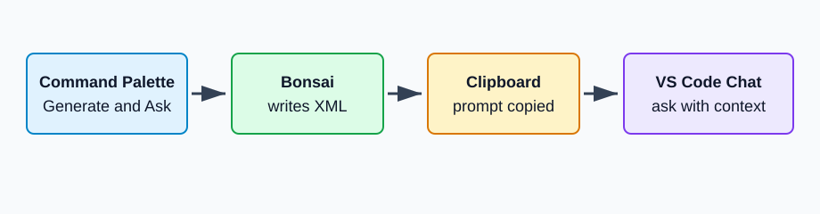
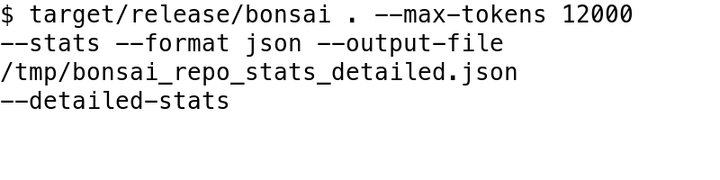
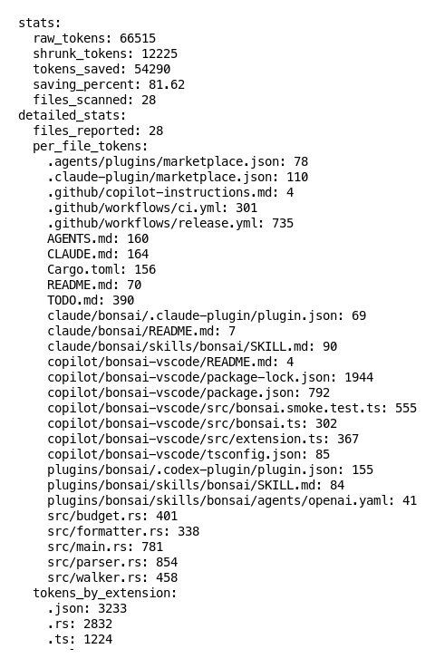

<p align="center">
  
</p>

<p align="center">
  <a href="./LICENSE"></a>
  
  
</p>

# Bonsai

Bonsai turns a local repository into a small, repeatable context file for LLMs.

It scans source files, compresses code with syntax-aware summaries, respects your token budget, and writes XML or JSON you can paste into ChatGPT, Codex, Claude, Copilot, or another agent.

Use it when you want an LLM to understand a whole project before asking for architecture, onboarding, review, or branch-change help.

The core is a Rust CLI. Tree-sitter handles code structure; compact fallbacks handle
Markdown, manifests, web templates, and Objective-C. The VS Code extension has its
own TypeScript engine, while the Codex and Claude integrations use the CLI.

## Install with Homebrew

```sh
brew tap MickyBalladelli/bonsai https://github.com/MickyBalladelli/bonsai.git
brew install bonsai
```

## Quick Start

Install Bonsai, check it once, then run it inside a repository:

```sh
bonsai setup
```

Full repository context:

```sh
bonsai .
```

This writes:

```text
bonsai.xml
```

The default is 12,000 tokens at compression level 2, written as XML.

Paste that file into an LLM and ask:

```text
Use this Bonsai repo context. Explain the architecture and tell me where to start reading.
```

For a larger context budget:

```sh
bonsai . --max-tokens 24000 --level 2 --output-file /tmp/bonsai.xml
```

For a paste-ready prompt:

```sh
bonsai . --prompt --output-file /tmp/bonsai-prompt.txt
```

Choose the right flow from [the decision table](docs/decision-table.md).

Save common choices in `.bonsai.toml`. Bonsai loads this file from the target
repository automatically. Command-line flags win over config values.

## Beginner Flows

Full context:

```sh
bonsai .
```

Changed context against a Git branch:

```sh
bonsai . --preset changed --changed-since main --output-file bonsai-changes.xml
```

Project map only:

```sh
bonsai . --preset map --output-file bonsai-map.xml
```

## Quick Setup For Agents

Run this once in any repo where you want agents to use Bonsai first:

```sh
bonsai init-agent
```

If the files do not already exist, it writes:

```text
AGENTS.md
CLAUDE.md
```

Those files tell Codex, Claude Code, and similar agents to run Bonsai before answering broad project questions.

The command refuses to overwrite an existing file unless you pass `--force`.

Create only one file, or tune the generated instruction:

```sh
bonsai init-agent --files agents
bonsai init-agent --files claude --style detailed
bonsai init-agent --max-tokens 8000 --output-file /tmp/bonsai.xml
```

Overwrite existing files:

```sh
bonsai init-agent --force
```

## Install

Download a release binary. The commands below verify SHA-256, install to the
standard `/usr/local/bin/bonsai` path, and leave no binary-path guessing.

```text
https://github.com/MickyBalladelli/bonsai/releases/latest
```

Release assets:

```text
bonsai-linux-x64
bonsai-macos-arm64
bonsai-linux-x64.sha256
bonsai-macos-arm64.sha256
bonsai-vscode-*.vsix
```

macOS Apple Silicon:

```sh
curl -fL -o bonsai-macos-arm64 https://github.com/MickyBalladelli/bonsai/releases/latest/download/bonsai-macos-arm64
curl -fL -o bonsai-macos-arm64.sha256 https://github.com/MickyBalladelli/bonsai/releases/latest/download/bonsai-macos-arm64.sha256
if test "$(awk '{print $1}' bonsai-macos-arm64.sha256)" != "$(shasum -a 256 bonsai-macos-arm64 | awk '{print $1}')"; then
  echo "SHA-256 verification failed"
  exit 1
fi
chmod +x bonsai-macos-arm64
sudo install -m 755 bonsai-macos-arm64 /usr/local/bin/bonsai
bonsai --version
```

Linux x64:

```sh
curl -fL -o bonsai-linux-x64 https://github.com/MickyBalladelli/bonsai/releases/latest/download/bonsai-linux-x64
curl -fL -o bonsai-linux-x64.sha256 https://github.com/MickyBalladelli/bonsai/releases/latest/download/bonsai-linux-x64.sha256
if test "$(awk '{print $1}' bonsai-linux-x64.sha256)" != "$(sha256sum bonsai-linux-x64 | awk '{print $1}')"; then
  echo "SHA-256 verification failed"
  exit 1
fi
sudo install -m 755 bonsai-linux-x64 /usr/local/bin/bonsai
bonsai --version
```

Install from this checkout:

```sh
cargo install --path .
```

Install from GitHub:

```sh
cargo install --git https://github.com/MickyBalladelli/bonsai.git
```

Homebrew formula:

```sh
brew install --build-from-source ./Formula/bonsai.rb
```

To install this repository as a tap, use the explicit URL because the
repository is named `bonsai`, not `homebrew-bonsai`:

```sh
brew tap MickyBalladelli/bonsai https://github.com/MickyBalladelli/bonsai.git
brew install bonsai
```

The formula builds from the tagged source and needs Rust. Release binaries are
faster when a matching macOS Apple Silicon or Linux x64 asset is available.
See [the Homebrew guide](docs/homebrew.md) if you are publishing a tap.

Check your install:

```sh
bonsai setup
bonsai doctor
```

## What Bonsai Keeps

Bonsai has three compression levels:

```text
--level 1  Full code first, then shrink if needed
--level 2  Imports, signatures, types, classes, and function shapes
--level 3  Compact tree map only
```

Example source:

```rust
fn greet(name: &str) -> String {
    let message = format!("hello {name}");
    println!("{message}");
    message
}
```

Level 2 skeleton:

```rust
fn greet(name: &str) -> String { ... }
```

Level 3 tree map:

```text
fn greet(name: &str) -> String
```

Markdown keeps headings, useful summary text, tables, lists, links, and code fence language names. Config files keep important top-level shape, supported top-level comments, and tuned nested sections for common manifests like `package.json`, GitHub workflows, `Cargo.toml`, Codex plugin manifests, and VS Code manifests. Markdown, config, and web-template line truncation is token-aware. Long Markdown tables/lists and import/include/use blocks keep the first few lines and collapse the rest.

## Common Commands

### Everyday output

Write XML to `bonsai.xml`:

```sh
bonsai .
```

Use a simple flow preset:

```sh
bonsai . --preset full
bonsai . --preset changed
bonsai . --preset map
bonsai . --preset prompt
```

`full` is the normal context, `changed` uses the local cache, `map` writes only
the project map, and `prompt` wraps the context and copies it to the clipboard.

## Config

Create `.bonsai.toml` in a repository to keep the settings you use most:

```toml
max_tokens = 12000
level = 2
format = "xml"
output = "file"
output_file = "bonsai.xml"
include = ["src/**"]
exclude = ["**/generated/**"]
respect_gitignore = true
exclude_generated = false
```

Supported settings are `preset`, `max_tokens`, `tokenizer`, `max_file_bytes`,
`max_file_tokens`, `level`, `output`, `output_file`, `format`,
`project_map_only`, `incremental`, `changed_since`, `include`, `exclude`,
`respect_gitignore`, and `exclude_generated`. Use `--config PATH` to load a
different file.

Check first-run setup:

```sh
bonsai setup
```

### Output formats and prompts

Write JSON:

```sh
bonsai . --format json --output-file /tmp/bonsai.json
bonsai . --format text --output-file /tmp/bonsai.txt
```

Copy a prompt to the clipboard:

```sh
bonsai . --prompt --output clipboard
```

### Selection and budget

Use a model-family tokenizer:

```sh
bonsai . --tokenizer gpt-4o
bonsai . --tokenizer o200k_base
```

Make a compact architecture map:

```sh
bonsai . --level 3
```

Write only the project map:

```sh
bonsai . --project-map-only
bonsai . --project-map compact --project-map-only
```

Include stable file hashes in the project map:

```sh
bonsai . --file-hashes
```

Omit token count fields from XML/JSON:

```sh
bonsai . --no-token-counts
```

Write metadata and project map without file bodies:

```sh
bonsai . --no-content
```

Show selected files:

```sh
bonsai . --print-files
```

Preview selected files and estimated tokens without writing output:

```sh
bonsai . --dry-run
```

Suppress normal stdout for scripts:

```sh
bonsai . --quiet --output-file /tmp/bonsai.xml
```

Generate shell completions:

```sh
bonsai completions bash > ~/.local/share/bash-completion/completions/bonsai
bonsai completions zsh > ~/.zfunc/_bonsai
bonsai completions fish > ~/.config/fish/completions/bonsai.fish
```

Filter files:

```sh
bonsai . --include 'src/**' --exclude '**/generated.rs'
bonsai . --exclude-generated
```

`--exclude-generated` skips minified, vendored, generated, and lockfile-like files. A matching `--include` pattern keeps explicit paths.

Sort output:

```sh
bonsai . --sort priority
bonsai . --sort tokens
bonsai . --sort path
```

Add directory token summaries:

```sh
bonsai . --directory-summaries
```

Use only metadata, the project map, and directory summaries when the requested budget is tiny:

```sh
bonsai . --max-tokens 800 --map-only-under 1000
```

Fail if output cannot fit after maximum compression:

```sh
bonsai . --max-tokens 12000 --fail-over-budget
```

Drop lowest-priority files if maximum compression still does not fit:

```sh
bonsai . --max-tokens 12000 --drop-low-priority
```

Cap very large files before the global budget pass:

```sh
bonsai . --max-file-tokens 2000
```

Advanced options are grouped in `bonsai --help` under Budget, Output, Changes,
Selection, Diagnostics, and Prompt.

See the [generated CLI option reference](docs/cli-options.md). Refresh it after
changing CLI flags with `sh scripts/generate-cli-reference.sh`.

## Change-Focused Context

Recommended local changed-context flow:

```sh
bonsai .
bonsai . --preset changed
```

The first command creates the local baseline. The second command includes only
added or changed files and prints change counts. Run the normal command again
when you want to refresh the baseline. Use `bonsai cache clear` if the baseline
becomes stale.

Only include files changed since the last cached local run:

```sh
bonsai . --incremental
```

Show the incremental counts:

```sh
bonsai . --incremental --incremental-summary
```

Compare with another checkout or cache file:

```sh
bonsai . --incremental-base /path/to/base/repo
bonsai . --incremental-base /path/to/base.cache
```

Include tracked changes and untracked files against a git ref:

```sh
bonsai . --preset changed --changed-since main
```

Use the local cache for repeated work. Use `--changed-since <git-ref>` for a
branch comparison. Do not combine `--changed-since` with `--incremental` or an
incremental base.

Clear the local parse cache for a repo:

```sh
bonsai cache clear
bonsai cache clear /path/to/repo
```

See [the cache guide](docs/cache.md) for cache location, invalidation, and the
three changed-context workflows.

Bonsai stores file-selection options with the cache. If `--include`, `--exclude`, `--exclude-generated`, `--max-file-bytes`, or gitignore handling changes, the next incremental run includes selected files once instead of comparing against stale selection.

## Output

XML is default. JSON is available with `--format json`. Lower-overhead text is available with `--format text`.

Output includes:

```text
metadata     generated time, repo root, token budget, level, file count
project_map  file path, selected level, token count, optional hash
files        compressed file content and per-file token count
```

Use `--no-token-counts` to omit token count fields from XML/JSON output.

Schema details:

```text
docs/output-schema.md
```

## Supported Files

Tree-sitter parsing:

```text
.js .jsx .ts .tsx .py .rs .go .java .cs .swift .kt .c .h .cpp .hpp
```

Compact fallback:

```text
.m .mm .vue .svelte .astro .html .md .json .yaml .yml .toml
```

The [supported-file table](docs/supported-files.md) shows parser-backed files
and compact fallback files:

`bonsai doctor` reports the installed parser mode and availability.

Bonsai respects `.gitignore` and `.cursorignore` by default.

## Use With Codex, Claude, And VS Code

### Codex

This repo includes a Codex plugin:

```text
plugins/bonsai
```

Add the local marketplace:

```sh
codex plugin marketplace add ./.agents/plugins
```

Then install or enable `bonsai` in Codex.

Ask:

```text
Use $bonsai to compress this repo before answering.
```

### Claude Code

This repo includes a Claude Code plugin:

```text
claude/bonsai
```

Run Claude Code with the plugin:

```sh
claude --plugin-dir ./claude/bonsai
```

Use the skill:

```text
/bonsai:bonsai
```

### VS Code

The VS Code extension **Bonsai Context Manager** is published on the
Visual Studio Marketplace:

```text
https://marketplace.visualstudio.com/items?itemName=MickyBalladelli.bonsai-vscode
```

Install it from the Marketplace, or run:

```sh
code --install-extension MickyBalladelli.bonsai-vscode
```

The extension source lives here:

```text
copilot/bonsai-vscode
```

Primary Command Palette commands:

```text
Bonsai Context Manager: Generate
Bonsai Context Manager: Generate Changed
Bonsai Context Manager: Generate for Request
Bonsai Context Manager: Generate and Ask
Bonsai Context Manager: Preview Project Map
```

Other commands add agent instructions or create `.bonsai.toml`. `More Actions`
currently exposes `Open Last Context`. The extension scans, compresses, and
writes context itself. No Bonsai binary is required.

In VS Code 1.99 or newer, enable `Generate Bonsai Context` under Agent
`Select Tools`, or reference `#bonsai_generate_context` in chat. It generates
request-aware context and returns the context file paths to the agent.



## Examples

Command palette:



Output stats:



## Troubleshooting

VS Code extension:

```text
Install the latest from the Marketplace. The VS Code extension is self-contained and does not
need Bonsai installed separately.
```

Clipboard failure:

```text
Use --output file --output-file /tmp/bonsai.xml.
Clipboard access can fail in headless shells, remote sessions, or sandboxes.
```

No files selected:

```text
Run with --print-files.
Check --include, --exclude, .gitignore, and .cursorignore.
Use --no-respect-gitignore if ignored files should be included.
```

Output over budget:

```text
Use a smaller path, add --exclude, increase --max-tokens, or use --level 3.
```

Check parser and tokenizer health:

```sh
bonsai doctor
bonsai doctor --json
```

It also reports the cache path, cache size, cache entry count, stored selection metadata, and stale entries.

`bonsai setup` shows the CLI version and checks the binary, tokenizer, parsers,
clipboard, repository, and output path.

## Development

Check:

```sh
cargo check
```

Test:

```sh
cargo test
```

CLI integration tests include golden output and token-cost fixtures for large Markdown tables, large config files, import-heavy code, and many-file repos.

Build:

```sh
cargo build --release
```

Build the VS Code extension:

```sh
cd copilot/bonsai-vscode
npm install
npm run compile
npm run package
```

Maintenance notes and the release checklist live in
[docs/maintenance.md](docs/maintenance.md).

## Names

The GitHub repository, CLI binary, Codex plugin, and Claude plugin are named `bonsai`.

The VS Code package is named `bonsai-vscode`.
